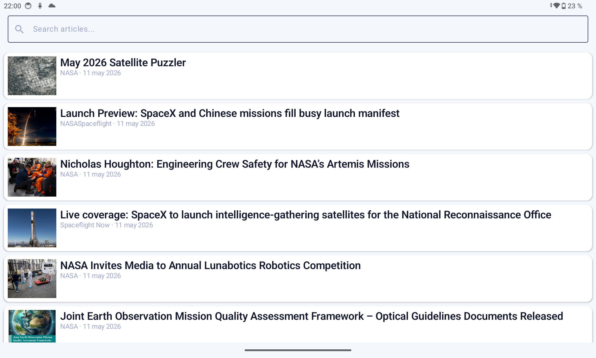
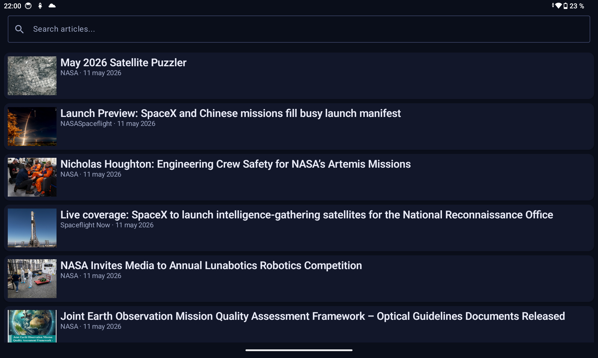
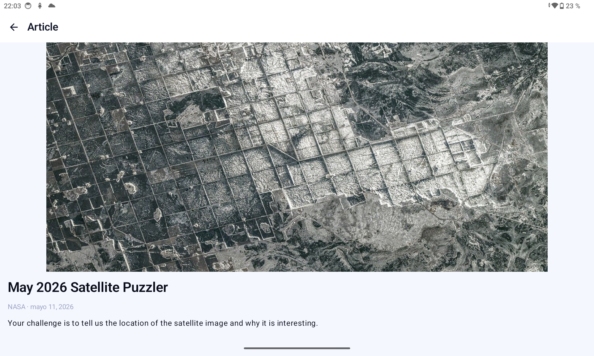
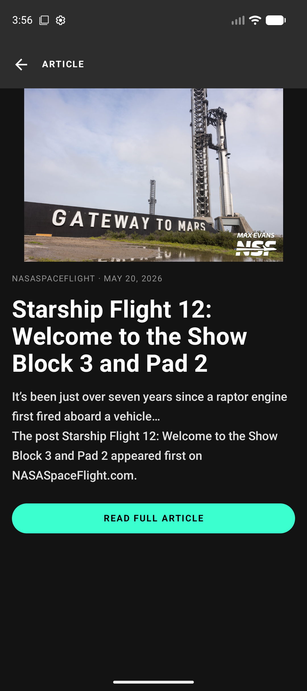

# Space Flight News

An Android application for browsing and searching space flight news articles, built with a production-grade multi-module architecture.


---

## Overview

Space Flight News consumes the [Space Flight News API](https://api.spaceflightnewsapi.net/v4/) to present a searchable, paginated list of articles and a full article detail view. The app works offline by serving locally cached content while syncing in the background.

**Key capabilities:**
- Email/password and anonymous authentication via Firebase Auth
- Per-user theme preference persisted with DataStore
- Adaptive two-pane layout on landscape tablets with rotation state persistence
- Real-time search with debounce, FTS, and offline fallback
- Shared element transitions between list and detail
- Spanish localization
- Feature flags via Firebase Remote Config

---

## Architecture at a Glance

The project is structured as a multi-module Gradle build. Each module has a well-defined responsibility and enforced dependency boundary. Firebase is used exclusively in `:app` behind domain interfaces — no Firebase imports exist in feature or core modules.

```
:app
├── :features:news          Search + article list
├── :features:detail        Article detail
├── :core:domain            Pure Kotlin: entities, use cases, repository interfaces
├── :core:data              Repository implementations, Paging 3 RemoteMediator
├── :core:network           Retrofit, OkHttp, NetworkResult<T>
├── :core:database          Room, DAOs, PagingSource
├── :core:designsystem      Design tokens: color, typography, shape, spacing
├── :core:ui-components     Atomic Compose widgets (Slot-based APIs)
└── :core:common            Shared extensions
```

→ Full architecture documentation: [docs/ARCHITECTURE.md](docs/ARCHITECTURE.md)

---

## Screenshots

| News List — Light | News List — Dark |
|---|---|
|  |  |

| Article Detail — Light | Article Detail — Dark |
|---|---|
|  |  |

---

## Getting Started

### Prerequisites

- Android Studio Meerkat (2025.1) or later
- JDK 17
- Android SDK 36
- Firebase project with `google-services.json` placed in `app/`

### Clone

```bash
git clone https://github.com/mauromarod/SpaceFlightNews.git
cd SpaceFlightNews
```

### Firebase Setup

Place your `google-services.json` in the `app/` directory. This file is excluded from version control. In CI it is injected from the `GOOGLE_SERVICES_JSON` secret (base64-encoded).

### Local Properties

`local.properties` is excluded from version control. Create it at the project root:

```properties
sdk.dir=/Users/<your-username>/Library/Android/sdk
```

For release builds, also add the signing configuration:

```properties
RELEASE_KEYSTORE_PATH=/path/to/your/upload.jks
RELEASE_STORE_PASSWORD=<store-password>
RELEASE_KEY_ALIAS=upload
RELEASE_KEY_PASSWORD=<key-password>
```

### Build & Run

```bash
# Debug build
./gradlew :app:installDebug

# Release AAB (requires signing config)
./gradlew :app:bundleRelease
```

Or open the project in Android Studio and run the `app` configuration.

### Run Tests

```bash
# Unit tests (all modules)
./gradlew testDebugUnitTest

# Snapshot tests — verify against golden images
./gradlew verifyRoborazziDebug

# Snapshot tests — record new goldens
./gradlew recordRoborazziDebug
```

### Lint & Static Analysis

```bash
./gradlew lint
./gradlew detekt
```

### E2E Tests (Maestro)

Requires a connected device or emulator with the debug build installed.

```bash
maestro test maestro/happy_path.yaml
maestro test maestro/rotation_article_persistence.yaml
```

---

## Firebase Features

| Feature | Implementation |
|---|---|
| **Auth** | Email/password + anonymous sign-in; `AuthRepository` interface in `:core:domain` |
| **Analytics** | Article opens, search funnel (`search_performed` → `search_converted`), external URL events |
| **Remote Config** | Feature flags: `feature_theme_toggle_enabled`, `feature_language_selection_enabled`; refreshed on app resume |
| **Crashlytics** | Non-fatal reporting via `CrashReporter` interface; user ID set post-login |
| **Performance** | Custom traces: `articles_network_fetch` (with `load_type` + `articles_count` attributes), TTFD |

---

## Documentation

| Document | Description |
|---|---|
| [ARCHITECTURE.md](docs/ARCHITECTURE.md) | Module graph, MVI contract, data flow diagrams, design decisions |
| [TECH_STACK.md](docs/TECH_STACK.md) | All dependencies with versions and rationale |
| [TESTING_STRATEGY.md](docs/TESTING_STRATEGY.md) | Testing pyramid, Robot Pattern, snapshot testing, E2E flows |
| [API_CONTRACT.md](docs/API_CONTRACT.md) | API endpoints, data models, error handling, pagination strategy |
| [roadmap/INDEX.md](docs/roadmap/INDEX.md) | Development roadmap — stage progress, dependency graph |

---

## Project Structure

```
SpaceFlightNews/
├── app/                    Application module (entry point, DI composition root, Firebase impls)
├── features/
│   ├── news/               Article list + search screen
│   └── detail/             Article detail screen
├── core/
│   ├── domain/             Business logic (pure Kotlin, no Android/Firebase deps)
│   ├── data/               Repository implementations, RemoteMediator
│   ├── network/            HTTP layer (Retrofit + OkHttp)
│   ├── database/           Room persistence layer
│   ├── designsystem/       Design tokens and Material3 theme
│   ├── ui-components/      Shared Compose components
│   └── common/             Shared utilities
├── docs/                   Engineering documentation
├── maestro/                Maestro E2E flow files
└── .github/workflows/      CI pipeline definitions
```

---

## CI/CD

The GitHub Actions pipeline runs on every push and pull request:

| Job | Trigger | Description |
|---|---|---|
| `lint` | push / PR | Android lint + Detekt static analysis |
| `unit-tests` | push / PR | Unit tests across all modules |
| `instrumented-tests` | push / PR | Compose UI tests on emulator |
| `build-release` | push to `main` | Signed AAB ready for Play Store upload |

Release signing credentials are injected via GitHub Secrets (`RELEASE_KEYSTORE_BASE64`, `RELEASE_STORE_PASSWORD`, `RELEASE_KEY_ALIAS`, `RELEASE_KEY_PASSWORD`).

---

## License

```
Copyright 2026 Mauro Marod

Licensed under the Apache License, Version 2.0 (the "License");
you may not use this file except in compliance with the License.
You may obtain a copy of the License at

    http://www.apache.org/licenses/LICENSE-2.0
```
