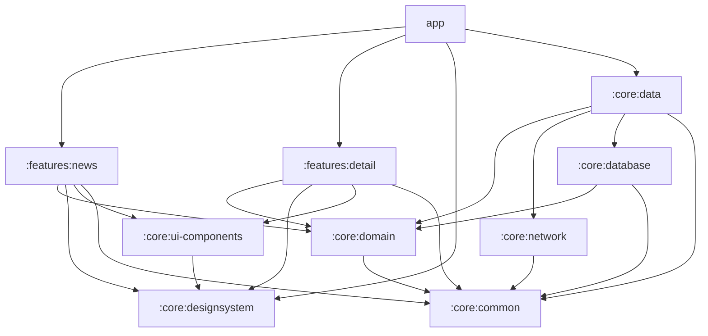

# Architecture

## Unidirectional Data Flow

```
┌─────────────────────────────────────────────────────────────────┐
│                          UI Layer                               │
│                                                                 │
│   Composable ──► UiEvent ──► ViewModel ──► UiState (StateFlow) │
│       ▲                          │                              │
│       └──────────────────────────┘                              │
│                                                                 │
│                   Channel<UiEffect> (one-shot)                  │
│                   NavigateToDetail / ShowSnackbar / OpenUrl     │
└─────────────────────────────────────────────────────────────────┘
                             │ suspend fun / Flow
┌─────────────────────────────────────────────────────────────────┐
│                        Domain Layer                             │
│                                                                 │
│   UseCase ──► ArticleRepository (interface) ──► Article model   │
└─────────────────────────────────────────────────────────────────┘
                             │ implements
┌─────────────────────────────────────────────────────────────────┐
│                         Data Layer                              │
│                                                                 │
│   ArticleRepositoryImpl                                         │
│        ├── :core:network  (Retrofit, NetworkResult<T>)          │
│        └── :core:database (Room, RemoteMediator, PagingSource)  │
└─────────────────────────────────────────────────────────────────┘
```

---

## Module Graph



**Dependency rules:**
- `:core:domain` is a pure Kotlin module — zero `android.*` imports (enforced by ArchUnit)
- Feature modules depend on `:core:domain` interfaces, never on `:core:data` or `:core:network` directly
- `:core:ui-components` depends only on `:core:designsystem`, never on domain models
- `:app` is the only module allowed to depend on all others (composition root for Hilt)

---

## Layer Definitions

### Presentation — `:features:*`

- Composable screens observe `StateFlow<UiState>` via `collectAsStateWithLifecycle()`
- ViewModels hold `MutableStateFlow<UiState>` (private) and expose `StateFlow<UiState>` (public)
- One-shot side effects are emitted via `Channel<UiEffect>` and consumed in `LaunchedEffect`
- No direct dependency on `:core:data`, `:core:network`, or `:core:database`

### Domain — `:core:domain`

- Pure Kotlin module: no Android framework, no Coroutines Android extensions, no Room
- Use Cases are single-responsibility `operator fun invoke()` classes
- `ArticleRepository` is an interface — implementation lives in `:core:data`
- Domain models (`Article`) have no serialization annotations or framework coupling

### Data — `:core:data`

- `ArticleRepositoryImpl` bridges `:core:network` and `:core:database`
- Contains `ArticleMapper` (DTO → Domain model)
- `ArticleRemoteMediator` — Paging 3 `RemoteMediator` for the main feed (manages `remote_keys`, owns REFRESH/APPEND lifecycle)
- `SearchRemoteMediator` — `RemoteMediator` for search results (no `RemoteKeysDao`; offset tracked in-memory per session)
- Exposes `Flow<PagingData<Article>>` to the domain layer via the repository interface

### Network — `:core:network`

- Retrofit `ArticleApi` interface with suspend functions
- `ArticleDto` data classes with Moshi annotations
- `NetworkResult<T>` sealed class (see Error Propagation below)
- OkHttp interceptors: logging (debug only), exponential backoff retry

### Database — `:core:database`

- Room `AppDatabase` with `ArticleDao` and `RemoteKeysDao`
- `ArticleEntity` (Room entity) + `RemoteKeysEntity` + `ArticleFts` (FTS4 virtual)
- `ArticleEntityMapper` (entity → domain model)

---

## Package Structure

```
:features:news/
└── com.mauromarod.spaceflightnews.features.news/
    ├── NewsScreen.kt
    ├── NewsViewModel.kt
    ├── NewsUiState.kt
    ├── NewsUiEvent.kt
    └── NewsUiEffect.kt

:features:detail/
└── com.mauromarod.spaceflightnews.features.detail/
    ├── DetailScreen.kt
    ├── DetailViewModel.kt
    ├── DetailUiState.kt
    ├── DetailUiEvent.kt
    └── DetailUiEffect.kt

:core:domain/
└── com.mauromarod.spaceflightnews.core.domain/
    ├── model/
    │   └── Article.kt
    ├── repository/
    │   └── ArticleRepository.kt
    └── usecase/
        ├── GetArticlesUseCase.kt
        ├── GetArticleDetailUseCase.kt
        └── SearchArticlesUseCase.kt

:core:data/
└── com.mauromarod.spaceflightnews.core.data/
    ├── repository/
    │   └── ArticleRepositoryImpl.kt
    ├── mediator/
    │   ├── ArticleRemoteMediator.kt
    │   └── SearchRemoteMediator.kt
    └── mapper/
        └── ArticleMapper.kt

:core:network/
└── com.mauromarod.spaceflightnews.core.network/
    ├── ArticleApi.kt
    ├── NetworkResult.kt
    ├── interceptor/
    │   ├── LoggingInterceptor.kt
    │   └── RetryInterceptor.kt
    └── dto/
        └── ArticleDto.kt

:core:database/
└── com.mauromarod.spaceflightnews.core.database/
    ├── AppDatabase.kt
    ├── converter/
    │   └── Converters.kt
    ├── dao/
    │   ├── ArticleDao.kt
    │   └── RemoteKeysDao.kt
    ├── entity/
    │   ├── ArticleEntity.kt
    │   ├── ArticleFts.kt
    │   └── RemoteKeysEntity.kt
    └── mapper/
        └── ArticleEntityMapper.kt

:core:designsystem/
└── com.mauromarod.spaceflightnews.core.designsystem/
    ├── Color.kt
    ├── Typography.kt
    ├── Shape.kt
    ├── Spacing.kt
    └── Theme.kt

:core:ui-components/
└── com.mauromarod.spaceflightnews.core.uicomponents/
    ├── ArticleCard.kt
    ├── SearchBar.kt
    ├── LoadingState.kt
    ├── EmptyState.kt
    ├── ErrorState.kt
    └── NetworkImage.kt

:core:common/
└── com.mauromarod.spaceflightnews.core.common/
    ├── dispatcher/
    │   └── CoroutineDispatchers.kt
    └── extension/
        ├── StringExtensions.kt
        └── DateExtensions.kt

:app/
└── com.mauromarod.spaceflightnews/
    ├── MainActivity.kt
    ├── SpaceFlightNewsApplication.kt
    ├── navigation/
    │   ├── AppNavHost.kt
    │   └── Screen.kt
    └── di/
        ├── NetworkModule.kt
        ├── DatabaseModule.kt
        └── RepositoryModule.kt
```

---

## MVI Contract

Each feature module defines three sealed types following this pattern:

```kotlin
// UiState — the complete, immutable snapshot of what the UI shows
sealed interface NewsUiState {
    data object Loading : NewsUiState
    data class Content(val articles: LazyPagingItems<Article>) : NewsUiState
    data class Error(val message: String) : NewsUiState
}

// UiEvent — user intents flowing into the ViewModel
sealed interface NewsUiEvent {
    data class SearchQueryChanged(val query: String) : NewsUiEvent
    data class ArticleTapped(val articleId: Int) : NewsUiEvent
    data object RetryClicked : NewsUiEvent
}

// UiEffect — one-shot side effects consumed exactly once
sealed interface NewsUiEffect {
    data class NavigateToDetail(val articleId: Int) : NewsUiEffect
    data class ShowSnackbar(val message: String) : NewsUiEffect
}
```

**ViewModel contract:**

```kotlin
@HiltViewModel
class NewsViewModel @Inject constructor(
    private val getArticlesUseCase: GetArticlesUseCase,
    private val savedStateHandle: SavedStateHandle
) : ViewModel() {

    private val _uiState = MutableStateFlow<NewsUiState>(NewsUiState.Loading)
    val uiState: StateFlow<NewsUiState> = _uiState.asStateFlow()

    private val _uiEffect = Channel<NewsUiEffect>(Channel.BUFFERED)
    val uiEffect: Flow<NewsUiEffect> = _uiEffect.receiveAsFlow()

    fun onEvent(event: NewsUiEvent) { /* ... */ }
}
```

**State preservation across rotation:** `SavedStateHandle` stores the current search query. The ViewModel restores it on recreation without requiring the UI to re-emit the event.

---

## Navigation

```kotlin
sealed class Screen(val route: String) {
    data object NewsList : Screen("news_list")
    data class ArticleDetail(val articleId: Int) : Screen("article_detail/{articleId}") {
        companion object {
            fun createRoute(id: Int) = "article_detail/$id"
        }
    }
}
```

`AppNavHost` lives in `:app` and is the single entry point for all navigation. Feature modules expose their screens as composable functions but do not own the `NavController`.

---

## Data Flow Diagrams

### Search Flow

```
User types query
      │
      ▼ (300ms debounce via Flow.debounce)
SearchArticlesUseCase
      │
      ▼
ArticleRepository.searchArticles(query: String): Flow<PagingData<Article>>
      │
      ├─ PagingSource ──► Room FTS query (articles_fts MATCH 'query*')
      │                    emits cached results immediately
      │
      └─ SearchRemoteMediator ──► GET /articles/?search=query&limit=32&offset=N
                                        │
                                        ▼
                                  articleDao.insertAll(results)
                                        │
                                  Room invalidates PagingSource → re-emits
      │
      ▼
PagingData<Article> emitted to NewsViewModel
      │
      ▼
UiState.Content(articles: LazyPagingItems<Article>)
      │
      ▼
LazyColumn in NewsScreen recomposes with new pages
```

### Offline-First Load Flow

```
App launched / scroll threshold reached
      │
      ▼
Paging 3 requests next page
      │
      ▼
ArticleRemoteMediator triggered (RemoteMediator.load)
      │
      ├─ Network available ──► GET /articles/?limit=20&offset=N
      │                              │
      │                              ▼
      │                        Room.withTransaction {
      │                          if (REFRESH) deleteAll()
      │                          insert(articles)
      │                          insert(remoteKeys)
      │                        }
      │
      └─ Network unavailable ─► Return MediatorResult.Error
                                 (Room PagingSource still emits cached data)
      │
      ▼
Room PagingSource emits updated data (regardless of network result)
      │
      ▼
UI always shows Room data — network is a background sync mechanism
```

### Detail Flow

```
User taps article card
      │
      ▼
NewsUiEvent.ArticleTapped(articleId)
      │
      ▼
NewsViewModel emits NewsUiEffect.NavigateToDetail(articleId)
      │
      ▼
NavController.navigate(Screen.ArticleDetail.createRoute(articleId))
      │
      ▼
DetailViewModel.init — GetArticleDetailUseCase(articleId)
      │
      ├─ Room cache hit ──► Article loaded instantly ──► UiState.Content
      │
      └─ Not cached ──► GET /articles/{id}/ ──► insert Room ──► UiState.Content
```

---

## Error Propagation

```kotlin
sealed class NetworkResult<out T> {
    data class Success<T>(val data: T) : NetworkResult<T>()
    data class HttpError(val code: Int, val message: String) : NetworkResult<Nothing>()
    data class NetworkError(val cause: Throwable) : NetworkResult<Nothing>()
    data class UnknownError(val cause: Throwable) : NetworkResult<Nothing>()
}
```

Mapping chain: `NetworkResult<T>` (network) → `Result<T>` (domain) → `UiState` (presentation). Each layer maps to its own error type — no raw exceptions propagate to the UI.

---

## Hilt Module Map

| Module file           | Provides                                        | Lives in        |
|-----------------------|-------------------------------------------------|-----------------|
| `NetworkModule`       | `OkHttpClient`, `Retrofit`, `ArticleApi`        | `:app/di`       |
| `DatabaseModule`      | `AppDatabase`, `ArticleDao`, `RemoteKeysDao`    | `:app/di`       |
| `RepositoryModule`    | `ArticleRepository` → `ArticleRepositoryImpl`   | `:app/di`       |
| `DispatchersModule`   | `CoroutineDispatchers`                          | `:core:common`  |

Use Cases and ViewModels use `@Inject` constructors — no explicit `@Provides` needed.

---

## Key Design Decisions

### Multi-Module Architecture

**Decision:** Separate Gradle modules per feature and core concern.

**Rationale:** Compile-time isolation means a change in `:features:detail` does not trigger recompilation of `:features:news`. Gradle's parallel module compilation significantly reduces build times as the module count grows. Module boundaries are enforced by the Kotlin compiler — it is impossible to accidentally import a database entity into a feature module.

### MVI over Plain MVVM

**Decision:** One `UiState` sealed class per screen, events flow in via `onEvent()`, effects flow out via `Channel`.

**Rationale:** A single immutable `UiState` snapshot eliminates the class of bugs where `isLoading = true` and `error != null` simultaneously. The `Channel<UiEffect>` ensures navigation and snackbars are delivered exactly once — `SharedFlow` can replay events to new collectors on rotation, causing duplicate navigation.

### Room as Single Source of Truth

**Decision:** The UI always observes Room. The network is a background sync mechanism only.

**Rationale:** `PagingSource` from Room emits automatically when the database changes. `RemoteMediator` writes to Room, which triggers the `PagingSource` to invalidate and re-emit. This gives offline support, instant UI updates, and a single path from data to UI.

### Custom Design System

**Decision:** Token-based theming in `:core:designsystem`. Atomic components in `:core:ui-components`.

**Rationale:** No raw color literals (`Color(0xFF...)`) or hardcoded dimension values (`16.dp`) appear outside the design system. Any future brand refresh requires changing only the token definitions. Slot-based component APIs (`ArticleCard`) allow feature screens to inject content without requiring component changes.

### `NetworkResult<T>` Sealed Class

**Decision:** All network calls return `NetworkResult<T>`. Exceptions are caught at the boundary and converted.

**Rationale:** Kotlin's type system enforces exhaustive handling at every `when` site. A ViewModel cannot ignore a `NetworkError` — the compiler will warn. This eliminates silent failures where an exception is caught and swallowed somewhere in the call chain.

### ArchUnit Enforcement

**Decision:** An ArchUnit rule asserts that no class in `:core:domain` imports any class from `android.*`.

**Rationale:** The domain layer's purity (no Android framework coupling) is a property that decays silently without automated enforcement. A single `import android.util.Log` in a Use Case breaks the compile-time guarantee. The rule runs as a unit test and fails the build on violation.
